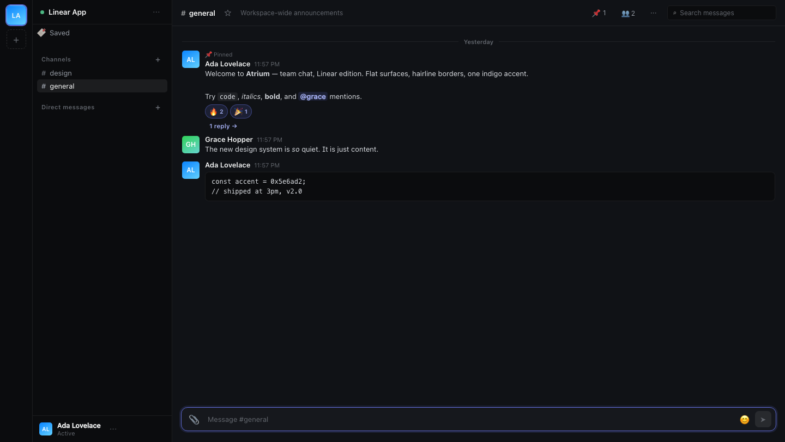

# 🔺 Atrium

An open-source, self-hostable team chat platform — workspaces, channels, threads, DMs, a real app platform (bot tokens, webhooks, slash commands, signed events), **Slack Connect-style federation between servers**, and a quiet **Linear-style** interface, on the web and as a **Mac desktop app**.



## Features

**Chat**
- Multi-workspace accounts, shareable invite links (one-time, infinite, or custom — with list & revoke), and domain auto-join (`@yourcompany.com` emails join automatically)
- Public & private channels (with member management), group DMs
- Threads, reactions, pins, saved messages, starred channels, muted channels
- @mentions with autocomplete, `@channel`/`@here`, @-broadcast chips
- Markdown-lite (bold/italic/code/blocks/quotes), custom workspace emoji, full emoji picker
- File attachments with image lightbox, inline video/audio players, drag-drop & paste upload
- Link unfurling (OpenGraph preview cards, SSRF-guarded)
- Unread & mention badges everywhere: sidebar, workspace rail, title bar, dock (desktop app)
- Full-text search (SQLite FTS5) with `from:` / `in:` filters, snippets, and jump-to-message
- Browser notifications, per-channel drafts, typing indicators, presence, reconnect resync

**Platform**
- Apps get a bot user, bot token (`xatb-…`), and HMAC signing secret
- Incoming webhooks, slash commands (in-channel or ephemeral), events API
- Events: `message.channels`, `message.im`, `message.updated`, `message.deleted`, `reaction.added`, `reaction.removed`, `channel.created`, `app_mention` — scoped to channels the bot is in
- Signed callbacks (HMAC-SHA256 + timestamp), retries, SSRF protection
- Bots are first-class API citizens — build agents on the same REST + WebSocket surface users get

**Federation** (Slack Connect-style)
- Connect workspaces across independent Atrium servers via single-use invite codes
- Shared channels mirrored between servers; messages, edits, and deletes relay both ways
- External DMs (`username` on a connected server)
- Remote people appear as shadow users (`ada@server`); signed server-to-server transport
- See **[docs/FEDERATION.md](docs/FEDERATION.md)**

**Desktop**
- Real macOS window (native traffic lights, vibrancy), dock unread badge, native notifications
- Connects to any Atrium server — see [Desktop app](#desktop-app)

## Quick start

Requires **Node.js ≥ 22.5** (for the built-in `node:sqlite`) — or Docker.

```bash
npm install
npm start
# → http://localhost:3000
# or: docker compose up -d --build
```

On first launch Atrium walks you through setup: create the first account, then
**create a workspace** or **join an existing one with an invite code**. No
database server, no build step.

**Deploying for real?** See **[docs/DEPLOYMENT.md](docs/DEPLOYMENT.md)** — Docker
and bare-metal/systemd paths, TLS with Caddy, backups, upgrades, and the
production checklist. Marketing/overview site lives in **[site/](site/index.html)**.

## Desktop app

```bash
cd desktop
npm install
ATRIUM_URL=http://localhost:3000 npm start
```

Build a distributable `.app` with `npm run dist` (electron-builder config included).
The web app detects the desktop shell automatically: it renders a drag strip for the
real traffic lights, reports unread counts to the dock badge, and sends native notifications.

## Configuration

| Env var                        | Default             | Purpose                                              |
| ------------------------------ | ------------------- | ---------------------------------------------------- |
| `PORT`                         | `3000`              | HTTP port                                            |
| `ATRIUM_DATA_DIR`               | `./data`            | SQLite database + uploaded files                     |
| `ATRIUM_PUBLIC_URL`             | `http://localhost:PORT` | This server's own URL — **required for federation** |
| `ATRIUM_ALLOW_LOCAL_FEDERATION` | off                 | Allow federation to private/localhost URLs (dev)     |
| `ATRIUM_ALLOW_LOCAL_CALLBACKS`  | off                 | Allow app callbacks to private/localhost URLs (dev)  |
| `ATRIUM_ALLOW_LOCAL_UNFURL`     | off                 | Allow unfurling local URLs (dev)                     |
| `ATRIUM_TRUST_PROXY`            | `false`             | Express trust-proxy: `true`, hop count, or subnet — only behind a real proxy (spoofable otherwise) |
| `ATRIUM_DISABLE_REGISTRATION`   | off                 | `1` closes registration once the first human account exists |

## Development

```bash
npm run dev                       # auto-restart on change
npm run smoke                     # 87-check end-to-end suite (API, realtime, app platform)
node scripts/smoke-federation.mjs # 48-check two-server federation suite
```

## Architecture

```
server/
  index.js        Express app, security headers, mounts, graceful shutdown
  db.js           node:sqlite schema + versioned migrations + FTS5
  auth.js         async scrypt, bearer sessions, bot tokens, HMAC signing
  realtime.js     WebSocket hub: fan-out, presence, typing, heartbeats
  apps.js         App engine: signed events dispatch, slash commands, retries
  federation.js   Federation engine: shadow users, signed relay fan-out
  bus.js          Sync event bus decoupling messages ↔ apps ↔ federation
  lib/            messages (create/serialize/batch), guards, ratelimit, netguard, unfurl
  routes/         auth, workspaces, channels, messages, users, uploads, apps, federation
public/           Zero-build ES-module SPA (Linear-style design system)
desktop/          Electron shell (mac window, dock badge, notifications)
site/             Static marketing site (zero-build, GitHub Pages-ready)
deploy/           Caddyfile for TLS termination
Dockerfile        All-in-one image (non-root, healthcheck, volume for /app/data)
docker-compose.yml
scripts/          smoke.mjs, smoke-federation.mjs
docs/             API.md, APPS.md, FEDERATION.md, DEPLOYMENT.md
examples/         echo-bot.js
```

Single SQLite file with WAL journaling; schema upgrades via a versioned migrations runner.

## API & apps

- REST API: **[docs/API.md](docs/API.md)** — every endpoint + the WebSocket event catalog.
- Building apps: **[docs/APPS.md](docs/APPS.md)** — tokens, signing, webhooks, slash commands, events, `examples/echo-bot.js`.
- Federation: **[docs/FEDERATION.md](docs/FEDERATION.md)** — connections, shared channels, external DMs, security model.

## Security notes

- Passwords: async scrypt, salted, timing-safe compare; rate-limited auth endpoints
- Sessions: 30-day bearer tokens, hourly purge of expired rows; bot tokens are workspace-scoped and can't create invites
- Uploads: extension allowlist, `nosniff`, active-content types forced to download; filenames are random 128-bit tokens (served unauthenticated by design — treat upload URLs as bearer URLs, like Slack's)
- App & federation callbacks: HMAC-SHA256 signed with timestamp; outbound URLs are DNS-resolved and private/loopback/metadata addresses are blocked (SSRF guard)
- App events only deliver messages from channels the bot is a member of — apps can't eavesdrop on DMs
- Domain auto-join trusts the email a user claims at registration (there's no email verification). Only enable `allowed_domains` on servers where registration itself is trusted — or gate registration with `ATRIUM_DISABLE_REGISTRATION=1` plus admin-issued invites
- CSP, frame, and referrer headers set; all SQL via prepared statements; private channels are invisible to non-members

Not affiliated with Slack. Behind a public deployment, terminate TLS at a reverse proxy (WebSocket upgrades work by default on nginx/caddy).

## Contributing

Issues and PRs welcome. Run both smoke suites before submitting — they cover auth, permissions, realtime, the app platform, and federation.

## License

[MIT](LICENSE)
